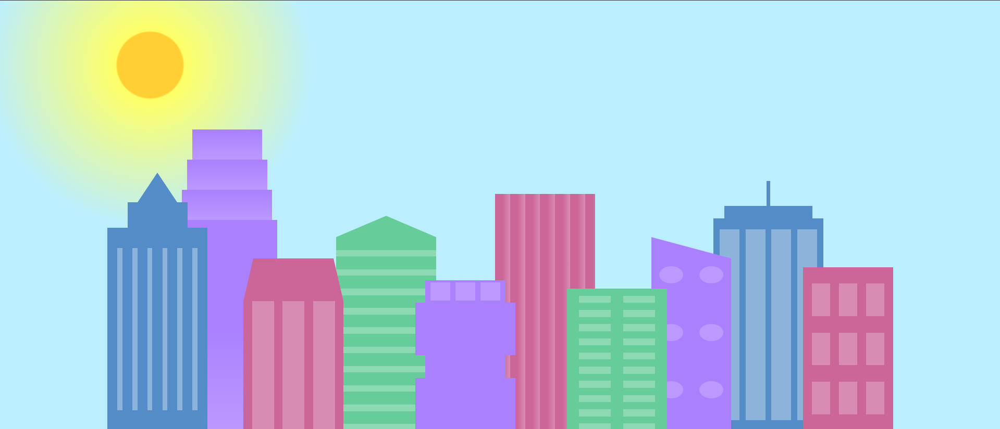
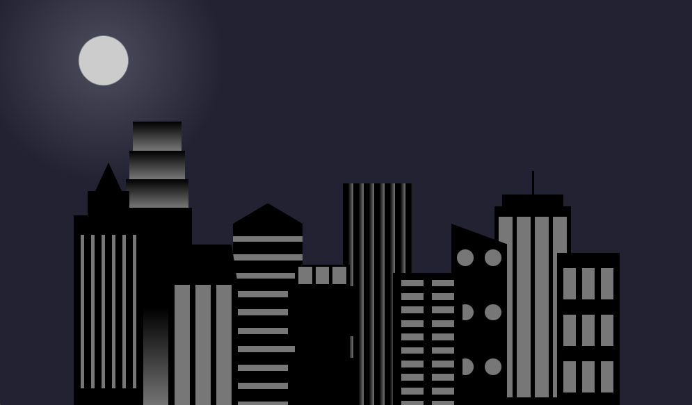

📌 City Skyline

Projeto realizado no freeCodeCamp, utilizando flexbox, responsividade de tela e explorando o uso de variáveis em CSS.

🛠️ Tecnologias Utilizadas

HTML5

CSS3

📸 Capturas de Tela (Opcional)

Abaixo algumas imagens do funcionamento do projeto, onde a primeira imagem representa a aparência do layout quando a largura máxima (max-width) da tela é superior a 1000px, enquanto a segunda imagem ilustra o layout quando a largura máxima da tela é inferior ou igual a 1000px.

🏗️ Como Usar

Clone este repositório:

git clone https://github.com/ChangCarlos/city-skyline.git

Abra o arquivo index.html em um navegador.

📌 Estrutura do Projeto

📂 city-skyline
│── 📂 css
│   └── styles.css
│── index.html
│── README.md
